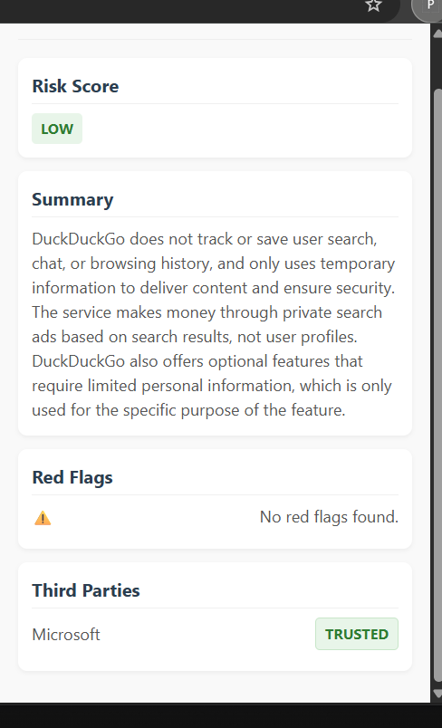
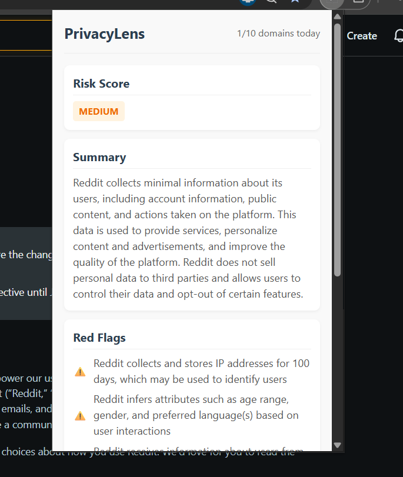
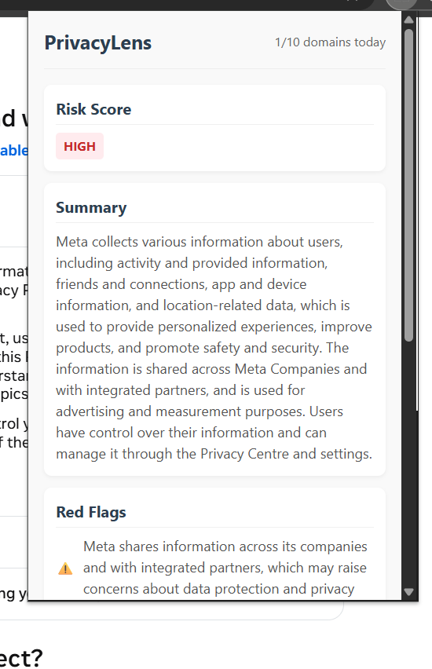

# PrivacyLens 🔍

> A Chrome Extension that reads Terms & Conditions and Privacy Policy pages so you don't have to.

Most people click "I Agree" without reading privacy policies — not because they don't care, but because the average policy is 5,000+ words of legal language designed to obscure more than it reveals. PrivacyLens fixes this by instantly summarizing any T&C or Privacy Policy page into plain English, flagging concerning clauses, identifying third-party data recipients, and assigning a risk score — all in under 5 seconds.

---

## Demo

| Low Risk | Medium Risk | High Risk |
|---|---|---|
|  |  |  |

---

## What It Does

- **Detects** T&C and Privacy Policy pages automatically (URL pattern + heading analysis)
- **Extracts** up to 30,000 characters of visible page text, filtering out nav, footer, and scripts
- **Summarizes** the policy in 2–3 plain-English sentences
- **Flags** specific concerning clauses — cross-subsidiary data sharing, behavioral profiling, indefinite retention, vague partner lists
- **Classifies** third-party services as Trusted, Caution, or Unknown using a deterministic lookup table of 40+ known services
- **Scores** overall risk as Low, Medium, or High
- **Caches** results per domain for 24 hours so repeat visits are instant
- **Limits** analysis to 10 new domains per day to stay within free API quotas

---

## Architecture

```
Chrome Extension (MV3)
│
├── content.js          Detects T&C pages, extracts text, sends to service worker
├── service-worker.js   Manages cache, rate limits, and backend communication
└── popup.js            Renders results from chrome.storage.local

        │ fetch (HTTPS)
        ▼

Node.js / Express Backend (Render)
│
├── server.js           Request validation, HTML sanitisation, IP rate limiting
├── summarize.js        Calls Groq API, parses JSON response, applies trust overrides
└── trustScore.js       Deterministic third-party classification (40+ entries)

        │ fetch
        ▼

Groq API — llama-3.3-70b-versatile
```

**Why this architecture?**

The AI call lives in the backend, not the extension. This keeps the API key off the client entirely — it never touches the browser. The extension only ever talks to our own backend over HTTPS.

---

## Tech Stack

| Layer | Choice | Why |
|---|---|---|
| Extension | Chrome MV3, Vanilla JS | No build step, no framework overhead |
| Backend | Node.js + Express | Lightweight, no extra dependencies |
| AI | Groq (`llama-3.3-70b-versatile`) | Free tier, LPU hardware = fast inference, no credit card |
| Hosting | Render free tier | Permanently free, auto-deploys from GitHub |
| HTTP client | Native `fetch` (Node v22) | No axios — supply chain attack on axios, March 2026 |
| Storage | `chrome.storage.local` | Persistent cache across popup opens, no server DB needed |

---

## Key Engineering Decisions

**Deterministic trust classification over AI guessing**
The AI is asked to name third parties, but trust classification is handled by `trustScore.js` — a lookup table of 40+ known services. Caution entries are checked before Trusted to prevent broad matches (e.g. "Google") from overriding specific ones ("Google Ads"). The AI's classification is only used as a fallback for unknown services.

**Prompt engineering for adversarial legal language**
Privacy policies from companies like Meta are carefully written to avoid phrases like "sell your data" while describing functionally equivalent practices. The HIGH risk prompt rules explicitly cover cross-subsidiary sharing, behavioral profiling, vague unnamed partner lists, and indefinite retention — not just explicit data selling.

**Cache-first, API-last**
Every result is cached by domain hostname for 24 hours in `chrome.storage.local`. Cache is always displayed regardless of daily usage count — the 10-domain limit only blocks new API calls, not access to existing results.

**Retry logic for transient rate limits**
Groq's free tier has a 12K tokens-per-minute (TPM) limit that can trigger during rapid consecutive calls. The backend parses the `retry_after` value from Groq's 429 response and retries once automatically if the wait is under 30 seconds (TPM). Longer waits (daily quota exhaustion) fail fast with a clear error rather than hanging.

**Text extraction strategy**
Content scripts extract up to 30,000 characters of visible body text, removing nav, footer, script, and style elements. This limit was raised from 15,000 after testing revealed that Meta's most concerning clauses appear well into the document — past what a 15K cap would capture.

---

## Known Limitations

- **Cold starts on Render:** The free tier sleeps after 15 minutes of inactivity. The first request after sleep takes 30–50 seconds to wake up the server.
- **Very long policies:** 30,000 characters covers most policies but not all. Extremely long documents (some financial services T&Cs) may be partially analyzed.
- **Page reload required after cache clear:** If `chrome.storage.local` is cleared while a T&C page is open, the page must be reloaded to re-trigger the content script.
- **Vague partner names:** Some companies (notably Meta) deliberately never name specific data partners in their policy. PrivacyLens correctly reports these as vague unnamed partners and flags this as a red flag.

---

## Running Locally

**Prerequisites:** Node.js v18+, a Groq API key (free at [console.groq.com](https://console.groq.com) — no credit card required)

**1. Clone the repo**
```bash
git clone https://github.com/Mehtazcode/privacy_lens.git
cd privacy_lens
```

**2. Set up the backend**
```bash
cd backend
npm install
cp .env.example .env
# Add your GROQ_API_KEY to .env
node server.js
```

**3. Load the extension**
- Open `chrome://extensions/`
- Enable **Developer mode**
- Click **Load unpacked**
- Select the `privacy_lens` root folder (where `manifest.json` lives)

**4. Test it**
Visit any Terms & Conditions or Privacy Policy page and click the PrivacyLens icon.

---

## Project Structure

```
privacy_lens/
├── manifest.json
├── popup/
│   ├── popup.html
│   ├── popup.css
│   └── popup.js
├── content/
│   └── content.js
├── background/
│   └── service-worker.js
├── backend/
│   ├── server.js
│   ├── summarize.js
│   ├── trustScore.js
│   └── .env.example
└── README.md
```

---

## Planned Features

- **Shared result cache** — analyze each domain once, serve to all users. One API call per site globally instead of per user, reducing quota usage by ~95% for popular sites. Requires a hosted database.
- **Policy change detection** — re-analyze cached domains when the policy text changes and alert the user.
- **Browser history scan** — check which sites the user has already accepted policies for and surface the highest-risk ones.

---

## Security

- API key lives exclusively in `backend/.env`, never in extension code or version control
- Extension requests only `activeTab`, `scripting`, and `storage` permissions
- Backend applies IP-based rate limiting (10 requests/min) before any AI call
- All input is HTML-sanitised on the backend before being sent to the AI
- Extension communicates with the backend over HTTPS only

---

Built by [Pratham](https://github.com/Mehtazcode) · MIT License
